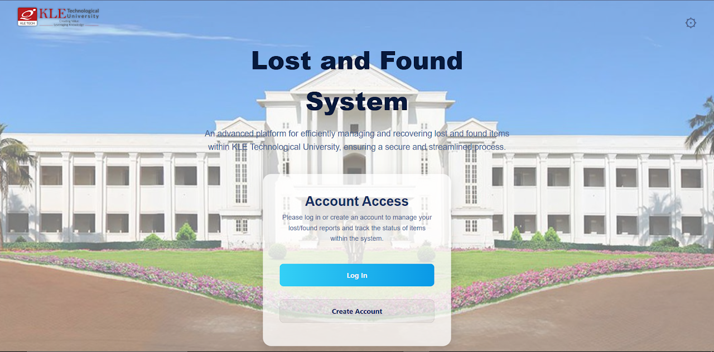

# Lost & Found Management System

## 📘 Project Information
**Project Title:** Lost & Found Management System  
**Institution:** **KLE Technological University, Hubballi**  
**Project Type:** Academic  
**Domain:** Web Applications and Software Enginerring 

---

## 📌 Overview
The **Lost & Found Management System** is a web-based application developed to manage lost and found items in a digital and organized manner. The system provides a centralized platform where users can report lost items, register found items, and search for matching records.

This project aims to eliminate the inefficiencies of traditional manual record-keeping systems by offering a structured, secure, and user-friendly solution. The system is particularly suitable for campus environments such as **KLE Technological University, Hubballi**, where tracking misplaced items efficiently is essential.

---

## 🎯 Objectives
- To provide a centralized digital platform for lost and found item management  
- To reduce manual effort and paperwork  
- To improve the recovery rate of lost items  
- To enable quick searching and matching of item records  
- To ensure transparency and accountability in item handling  

---

## 🛠️ Key Features
- 📝 **Report Lost Items**  
  Users can submit details including item name, category, description, and date of loss.

- 📦 **Report Found Items**  
  Found items can be registered with relevant information for identification.

- 🔍 **Search Items**  
  Users can search for lost or found items using keywords or categories.

- 🗂️ **Centralized Database**  
  All records are stored securely and managed efficiently.

- 🖥️ **User-Friendly Interface**  
  Simple and intuitive design for ease of use.

- 👨‍💼 **Admin Management**  
  Admin can verify, update, or remove item records.

---

## 🏗️ System Architecture
The system follows a layered architecture:

1. **User Interface Layer**  
   - Allows users to report and search for items.

2. **Application Logic Layer**  
   - Handles validations, processing, and business logic.

3. **Database Layer**  
   - Stores lost and found item records securely.

4. **Admin Module**  
   - Manages and monitors system data.

---

## 💻 Technology Stack

- **Frontend:** HTML, CSS, JavaScript, ReactJS
- **Backend:**  Node.js  
- **Database:** MongoDB  
- **Tools & Platforms:** Git, GitHub  

---

## 🚀 Installation & Setup
1. Clone the repository:
   ```bash
   git clone https://github.com/your-username/lost-found-system.git
   ```
2. Navigate to project directory:
   ```bash
   cd lost-found-system
   ```
3. Configure the database connection settings.

4. Run the backend server using the appropriate framework.

5. Open the application in a web browser or local server.

## 🚀 System Enhancements Implemented
The Lost & Found Management System includes the following advanced features:

- Secure user authentication with role-based access permissions  
- Automated email and SMS notifications for item match alerts  
- Image upload support to enhance item verification accuracy  
- AI-based intelligent matching of lost and found items  

---
## 📸 Screenshots

### 🏠 Login Page


**Description:**  
Displays the main landing page of the Lost & Found Management System with navigation options.

--- 

### 🏠 Registration Page


**Description:**  
Displays the main landing page of the Lost & Found Management System with navigation options.

---

### 🏠 Login Page


**Description:**  
Displays the main landing page of the Lost & Found Management System with navigation options.


---

### 📝 Report Lost Item Page


**Description:**  
Allows users to submit details of lost items such as item name, category, description, and date.

---

### 📦 Report Found Item Page


**Description:**  
Enables users to register found items along with relevant identifying information.

---

### 🔍 Search & Match Page


**Description:**  
Provides search functionality to find matching lost or found items using keywords or categories.


---

## 📜 Declaration
This project is developed as part of an academic requirement at **KLE Technological University, Hubballi**.  
The work presented is original and intended solely for educational purposes.

---

## 👩‍💻 Authors
**Student Name:** Tejaswini M V, Manjula Nayak, Rakshita R T, Soujanya Tikare 
**Institution:** KLE Technological University, Hubballi  

